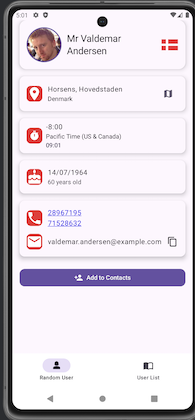
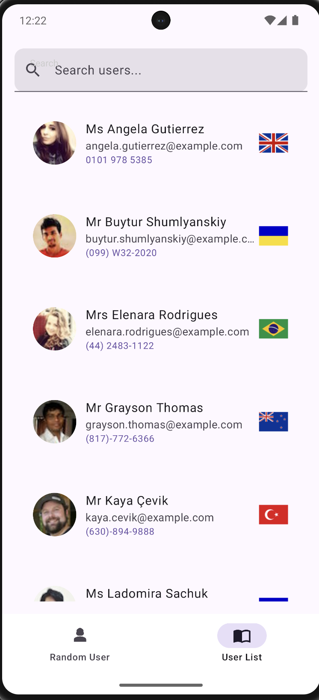

# Random User Android Project

This project is an Android application that consumes the [Random User API](https://randomuser.me/) to display user information and provide interactive features such as launching Google Maps with user locations and customizing icons based on user nationality.

## App Features

- [x] ~~Display user information fetched from the Random User API.~~
- [x] ~~Open Google Maps with the latitude and longitude provided by the API.~~
- [x] ~~Customize icons based on the user's nationality flag.~~
- [x] ~~Swipe-to-refresh: Enable users to refresh the data by swiping down.~~
- [x] ~~Added a json raw interceptor for bug tracing help~~
- [x] ~~Add copy icon near the email and click to copy to clipboard~~
- [x] ~~Clickable phone numbers: Enable users to initiate calls by tapping on phone numbers.~~
- [x] ~~Bottom navigation bar: Implement navigation for different app sections.~~
- [x] ~~Add to contacts: Add functionality to save users as contacts~~
- [x] ~~Add dedicated screen to display saved contacts.~~
- [x] ~~Handle empty list on saved contacts~~
- [x] ~~Offline detector~~
- [x]  ~~Offline screen and offline snack bar to Random User~~
- [x] ~~Make a search field on list~~
- [ ] Pagination to user list
- [ ] Caching(storing ids to avoid duplicating objects)
- [ ] A sticky letter list for easier navigation through the contact list.
- [ ] Filter Contact list by one or more user attributes
- [ ] Add long click behaviour to each item of contact list and show the delete option for multiple contacts
- [ ] Add a field to user details screen with the distance from the phone user and the detailed user(GPS permission required)


## Technical features

- [x] ~~Api fetching and display.~~
- [x] ~~Hilt DI including~~
- [x] ~~Add random user source as an injectable dependency~~
- [x] ~~Add random user repository as an injectable dependency~~
- [x] ~~Testing strategy in general~~
- [x] ~~Add safe api call with error handling on random user~~
- [x] ~~Add error handling on random user fetching on repository~~
- [x] ~~Add error handling on random user saving on repository~~
- [x] ~~Handle user click on user list~~
- [x] ~~Create a generic screen with loading, error and offline handling, also a state to handle common states~~
- [x] ~~Create a solution for time updating using broadcast receiver and intent filter action time tick~~
- [x] ~~Service to check if user is offline~~
- [ ] Integrate the broadcast receiver response to the view model logic to update the current user clock
- [ ] Add UI tests with Espresso
- [ ] Include and setup [Detekt library](https://github.com/detekt/detekt)

## Bug fixing

- [x] ~~Crash on user fetching~~
- [ ] When on fetch screen, go to list screen and go back to fetch screen the user must not be fetched again
- [ ] Improve search algorithm

## Screenshots

 

## Libraries and Tools

### Plugins
- **Android Application Plugin**: `com.android.application` version 8.7.2
- **Kotlin Android Plugin**: `org.jetbrains.kotlin.android` version 2.0.0
- **Kotlin Compose Plugin**: `org.jetbrains.kotlin.plugin.compose` version 2.0.0
- **Hilt Plugin**: `com.google.dagger.hilt.android` version 2.51.1
- **Kotlin Kapt Plugin**: `org.jetbrains.kotlin.kapt` version 2.0.0

### Dependencies

| Library                     | Version        | Purpose                             |
|-----------------------------|----------------|-------------------------------------|
| Android Core KTX            | 1.15.0         | Core Android extensions for Kotlin. |
| Lifecycle Runtime KTX       | 2.8.7          | Lifecycle-aware components.         |
| Lifecycle ViewModel Compose | 2.8.7          | Lifecycle ViewModel for Compose.    |
| Activity Compose            | 1.9.3          | Jetpack Compose integration.        |
| Navigation Compose          | 2.8.5          | Navigation support for Compose.     |
| Compose BOM                 | 2024.04.01     | Compose dependency management.      |
| Material Icons Extended     | Latest version | Material icons for Compose.         |
| Material3                   | 1.3.1          | Material Design 3 components.       |
| Coil Compose                | 3.0.4          | Image loading for Compose.          |
| Coil Network (OkHttp)       | 3.0.4          | Network support for Coil.           |
| Retrofit                    | 2.9.0          | REST API client.                    |
| Gson Converter              | 2.9.0          | JSON serialization/deserialization. |
| OkHttp                      | 5.0.0-alpha.2  | HTTP client.                        |
| Logging Interceptor         | 5.0.0-alpha.2  | Logging for HTTP requests.          |
| Hilt Android                | 2.51.1         | Dependency injection library.       |
| Hilt Navigation Compose     | 1.2.0          | Navigation support with Hilt.       |
| Palette KTX                 | 1.0.0          | Extract colors from images.         |
| Room Runtime                | 2.6.1          | Database layer for Android.         |
| Room KTX                    | 2.6.1          | Kotlin extensions for Room.         |
| Room Compiler               | 2.6.1          | Annotation processor for Room.      |
| Room Testing                | 2.6.1          | Testing utilities for Room.         |
| Kotlinx Datetime            | 0.6.1          | Date and time utilities for Kotlin. |
| Kotlinx Coroutines Test     | 1.7.3          | Coroutines testing utilities.       |
| Mockk                       | 1.13.7         | Mocking framework for Kotlin.       |
| JUnit                       | 4.13.2         | Unit testing framework.             |
| AndroidX Test JUnit         | 1.2.1          | Android JUnit integration.          |
| Espresso Core               | 3.6.1          | UI testing framework.               |
| Turbine                     | 1.0.0          | Flow testing utilities.             |


## Setup and Installation

1. Clone the repository:
   ```bash
   git clone https://github.com/yourusername/random-user-android.git
   ```
2. Open the project in Android Studio.
3. Sync the project to download dependencies.
4. Build and run the app on an emulator or physical device.

## API Information
The app fetches user data from the [Random User API](https://randomuser.me/). Below is an example of a typical API request:

```http
GET https://randomuser.me/api/
```

Refer to the [Random User API documentation](https://randomuser.me/documentation) for more details on available endpoints and response formats.

## Contributions

Feel free to submit pull requests to improve features, fix bugs, or implement items on the to-do list. Ensure to follow the existing code style and include proper documentation for any new features.

## License

This project is licensed under the MIT License. See the LICENSE file for details.

